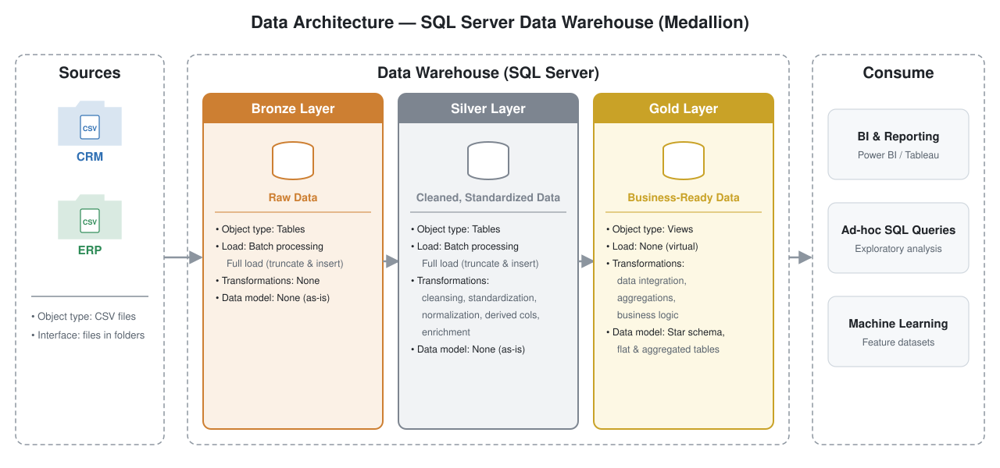
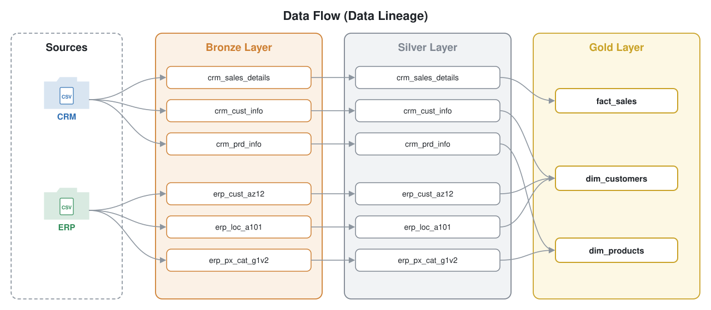
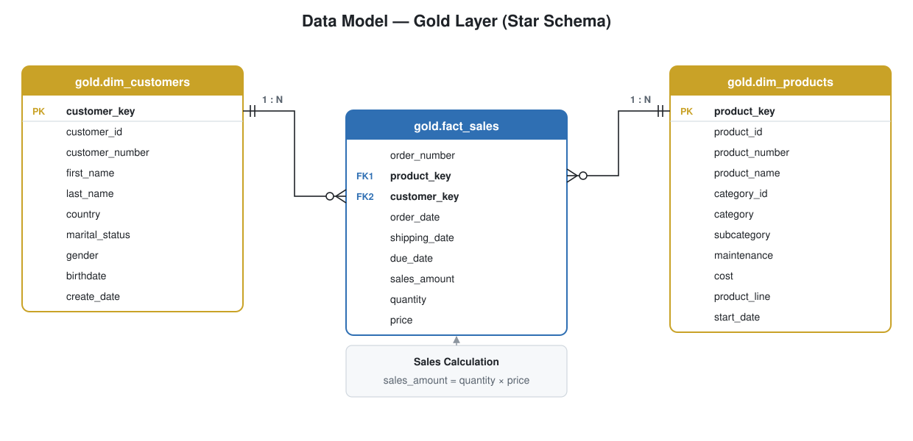

# Data Warehouse and Analytics Project

Welcome to my **Data Warehouse and Analytics Project** repository! 🚀
This project builds a modern data warehouse in **SQL Server** from scratch — from raw CSV exports of two source systems to a business-ready star schema — following industry best practices in data architecture, data engineering and data modeling.

---

## 🏗️ Data Architecture

The data architecture follows the Medallion Architecture with **Bronze**, **Silver**, and **Gold** layers:



1. **Bronze Layer**: Stores raw data as-is from the source systems. Data is ingested from CSV files into the SQL Server database (full load: truncate & `BULK INSERT`).
2. **Silver Layer**: Data cleansing, standardization, and normalization to prepare data for analysis (full load: truncate & insert).
3. **Gold Layer**: Business-ready data modeled into a star schema (views) for reporting and analytics.

---

## 📖 Project Overview

This project involves:

1. **Data Architecture**: Designing a modern data warehouse using the Medallion Architecture.
2. **ETL Pipelines**: Extracting, transforming, and loading data from the source systems into the warehouse.
3. **Data Modeling**: Developing fact and dimension tables optimized for analytical queries.
4. **Analytics & Reporting**: Creating SQL-based reports for actionable insights.

Skills demonstrated: SQL development · data architecture · data engineering · ETL pipeline development · data modeling · data analytics.

---

## 🔄 Data Flow & Model

| Data lineage | Star schema (Gold) |
|---|---|
|  |  |

How the source tables connect: [docs/data_integration.svg](docs/data_integration.svg) · Column-level documentation: [docs/data_catalog.md](docs/data_catalog.md)

---

## 🚀 Project Requirements

### Building the Data Warehouse (Data Engineering)

#### Objective
Develop a modern data warehouse using SQL Server to consolidate sales data, enabling analytical reporting and informed decision-making.

#### Specifications
- **Data Sources**: Import data from two source systems (ERP and CRM) provided as CSV files.
- **Data Quality**: Cleanse and resolve data quality issues prior to analysis.
- **Integration**: Combine both sources into a single, user-friendly data model designed for analytical queries.
- **Scope**: Focus on the latest dataset only; historization of data is not required.
- **Documentation**: Provide clear documentation of the data model to support both business stakeholders and analytics teams.

### BI: Analytics & Reporting (Data Analysis)

#### Objective
Develop SQL-based analytics to deliver detailed insights into **customer behavior**, **product performance** and **sales trends**.

For more details (layer design, ETL techniques), see [docs/requirements.md](docs/requirements.md).

---

## ▶️ Running the Project

**Tools (all free):** [SQL Server Express](https://www.microsoft.com/en-us/sql-server/sql-server-downloads) · [SQL Server Management Studio (SSMS)](https://learn.microsoft.com/en-us/sql/ssms/download-sql-server-management-studio-ssms) · [Draw.io](https://www.drawio.com/) · [Git/GitHub](https://github.com/)

Open each script in SSMS and execute it, in this order:

| # | Script | What it does |
|---|---|---|
| 1 | `scripts/init_database.sql` | Creates the `DataWarehouse` database and the `bronze`, `silver`, `gold` schemas ⚠️ drops it if it exists |
| 2 | `scripts/bronze/ddl_bronze.sql` | Creates the 6 bronze tables |
| 3 | `scripts/bronze/proc_load_bronze.sql` | Creates `bronze.load_bronze` |
| 4 | `scripts/silver/ddl_silver.sql` | Creates the 6 silver tables |
| 5 | `scripts/silver/proc_load_silver.sql` | Creates `silver.load_silver` |
| 6 | `EXEC bronze.load_bronze;` | Loads CSV → Bronze |
| 7 | `EXEC silver.load_silver;` | Loads Bronze → Silver |
| 8 | `scripts/gold/ddl_gold.sql` | Creates the Gold star-schema views |
| 9 | `tests/quality_checks_*.sql` | Data quality checks per layer |

Daily refresh after setup is just:

```sql
EXEC bronze.load_bronze;
EXEC silver.load_silver;   -- gold views are always up to date
```

**CSV path:** `bronze.load_bronze` reads the CSVs from
`C:\Users\Utkarsh Prithviraj\Desktop\SQL_data\sql-data-warehouse-project\datasets\`.
If you clone the repo somewhere else, search & replace that folder in `proc_load_bronze.sql`.

**"Cannot bulk load … Operating system error code 5 (Access is denied)"** — the SQL Server service account can't read your user folder. Either grant it read access (run in an admin Command Prompt):

```
icacls "C:\Users\Utkarsh Prithviraj\Desktop\SQL_data\sql-data-warehouse-project\datasets" /grant "NT Service\MSSQL$SQLEXPRESS":(OI)(CI)R /T
```

or copy the `datasets` folder to a neutral path such as `C:\sql\datasets\` and update the paths in the procedure.

### Expected results after a full load

| Layer | Object | Rows |
|---|---|---|
| Bronze | crm_cust_info / crm_prd_info / crm_sales_details | 18,494 / 397 / 60,398 |
| Bronze | erp_cust_az12 / erp_loc_a101 / erp_px_cat_g1v2 | 18,484 / 18,484 / 37 |
| Silver | crm_cust_info (deduplicated, NULL ids removed) | 18,484 |
| Gold | dim_customers / dim_products (current only) / fact_sales | 18,484 / 295 / 60,398 |

---

## 📂 Repository Structure

```
sql-data-warehouse-project/
│
├── datasets/                           # Raw datasets used for the project (ERP and CRM data)
│   ├── source_crm/                     # cust_info, prd_info, sales_details
│   └── source_erp/                     # CUST_AZ12, LOC_A101, PX_CAT_G1V2
│
├── docs/                               # Project documentation and architecture details
│   ├── data_architecture.svg           # The project's architecture (Medallion)
│   ├── data_flow.svg                   # Data flow / lineage diagram
│   ├── data_integration.svg            # How the source tables relate
│   ├── data_model.svg                  # Star schema of the Gold layer
│   ├── data_catalog.md                 # Gold layer catalog: tables, columns, descriptions
│   ├── naming_conventions.md           # Naming guidelines for schemas, tables, columns, procs
│   ├── requirements.md                 # Requirements & layer design decisions
│   └── project_plan.md                 # Epics & tasks
│
├── scripts/                            # SQL scripts for ETL and transformations
│   ├── init_database.sql               # Create database & schemas
│   ├── bronze/                         # Scripts for extracting and loading raw data
│   ├── silver/                         # Scripts for cleaning and transforming data
│   └── gold/                           # Scripts for creating analytical models
│
├── tests/                              # Data quality checks per layer
│
├── README.md                           # Project overview and instructions
├── LICENSE                             # License information for the repository
└── .gitignore                          # Files and directories to be ignored by Git
```

---

## 🙏 Credits

Built by following the **SQL Data Warehouse Project** course by [Data With Baraa](https://www.youtube.com/@datawithbaraa) — reference repository: [DataWithBaraa/sql-data-warehouse-project](https://github.com/DataWithBaraa/sql-data-warehouse-project). Datasets come from that project (MIT License).

## 🛡️ License

This project is licensed under the [MIT License](LICENSE). You are free to use, modify, and share this project with proper attribution.

## 🌟 About Me

Hi, I'm **Utkarsh Prithviraj** — <!-- add a one-line intro about yourself -->

<!-- Add your profiles, e.g.:
[](https://linkedin.com/in/your-profile)
-->
